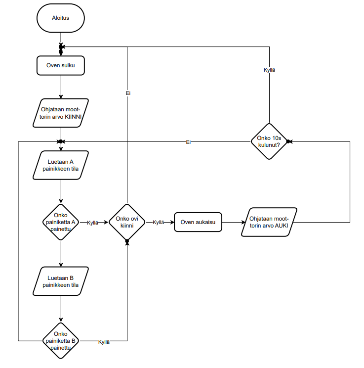

> [!NOTE]
> Materiaali on luotu ChatGPT:n ja Copilotin avulla.

# 🖊 Draw\.io (diagrams.net) – Kaavioiden ja visualisointien työkalu

## 🔎 Mikä on Draw\.io?

* Draw\.io (nykyisin nimellä **diagrams.net**) on **ilmainen verkkopohjainen työkalu kaavioiden ja visualisointien tekemiseen**.
* Sen avulla voidaan piirtää **vuokaavioita, prosessikuvauksia, verkkokaavioita, UML-kaavioita ja muita teknisiä piirroksia**.
* Työkalu toimii selaimessa, eikä vaadi rekisteröitymistä (voit tallentaa tiedostot koneelle tai pilvipalveluun).

## 🧩 Keskeiset ominaisuudet

* **Shapes (muodot)** = laatikot, ympyrät, päätöksentimantit ym.
* **Connectors (yhdistäjät)** = nuolet ja viivat, jotka yhdistävät muotoja.
* **Text (teksti)** = kuvausten ja nimikkeiden lisääminen.
* **Formatting (muotoilu)** = värien, viivatyylien ja fonttien muokkaus.
* **Export (vientimuodot)** = kaavio voidaan tallentaa kuvatiedostona (PNG/JPG) ja muokattavana versiona (.drawio).

## ✅ Miksi Draw\.io?

* Helppokäyttöinen ja monipuolinen – sopii sekä yksinkertaisiin että monimutkaisiin kaavioihin.
* Ei tarvitse ohjelmistoasennuksia – toimii selaimessa.
* Kätevä tapa **visualisoida prosesseja, tietojärjestelmiä ja projektien työnkulkuja**.
* Laajasti käytetty opetuksessa, IT-projekteissa ja dokumentoinnissa.

---

# 📝 Oppimistehtävä: Draw\.io tutuksi

## 🎯 Tehtävän tavoite

* Harjoitella kaavioiden tekemistä Draw\.io\:lla.
* Tutustua muotoihin, yhdistäjiin ja muotoiluun.
* Ymmärtää, miten kaaviot tukevat ohjelmistokehitystä.

## 🔧 Ohjeet

1. Mene osoitteeseen [https://app.diagrams.net/](https://app.diagrams.net/).
2. Valitse tallennuspaikaksi **Device** (tallenna paikallisesti).
3. Luo uusi kaavio nimellä **“Oma projektikaavio”**.
4. Piirrä alla olevan mallin mukainen lohkokaavio, joka kuvaa oviautomaatin toimintaa:

5. Tallenna kaavio kolmessa muodossa:

   * **.drawio** (muokattava versio).
   * **.png** tai **.jpg** (kuvatiedosto).

6. Kuvaa lyhyesti omin sanoin kuvan perusteella automaatin toiminta.
   * Käytä tekstipohjaista kerrontaa.
   * Jokainen lohko kuvaa kaaviossa jotain.
   * Jokainen lohko linkittyy oviautomaation toimintaan jotenkin.

---

## 📤 Palautus

* Muokattava tiedosto (.drawio).
* Kuvatiedosto (.png/.jpg).
* Kuvausteksti "Vastaan tehtävänantoon" ja sieltä "Vastaus" -laatikkoon